  

  
  
  

### `01` — A little about me

I'm **Bagas**, a passionate frontend developer from **Indonesia**. I enjoy turning ideas into interfaces and learning something new with every project.

- 🌱 Currently learning **Bootstrap, DaisyUI, Flowbite, and a little bit of GSAP**.
- 💬 Ask me about **HTML, CSS, JavaScript, PHP, and Tailwind CSS**.
- ⚡ Fun fact: **I enjoy learning new things about web development**.
- 📫 Reach me at **[bagasda93@gmail.com](mailto:bagasda93@gmail.com)**.

### `02` — My toolbox

  
   
  

Currently exploring

  
  
  
  

### `03` — Contribution playground

<!-- Run the included Generate contribution snake workflow once to create this image. -->

  

Real contributions. One small step at a time.

<b>Open my GitHub stats</b>

 

  
  

### `04` — Find me around the web

  
  

<!-- LinkedIn: add your actual profile URL here. The supplied URL contained spaces and has not been verified. -->

Always learning. Always building.

